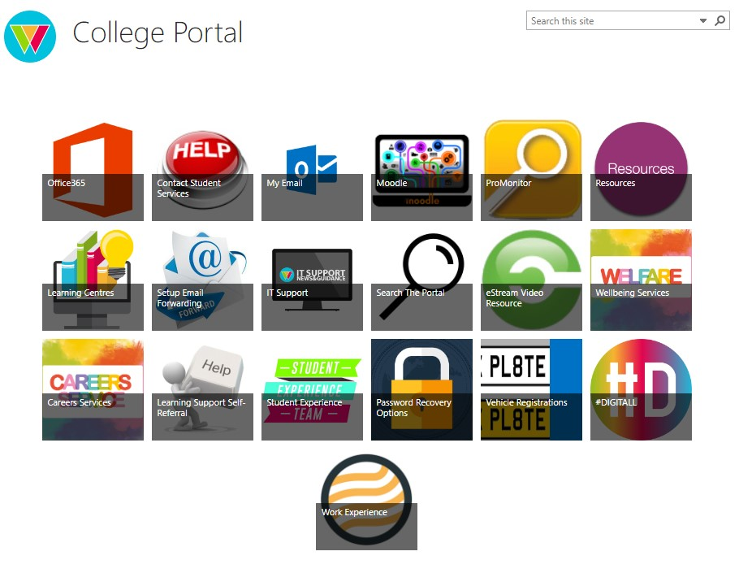

college portal
==============
[Home](docs/home.md) [Office 365](docs/office.md) [Pro-monitor](docs/promonitor.md) [Moodle](docs/moodle.md) [My Email](docs/email.md)

welcome to the home page!

## About the college portal:

The college portal consists of multiple applications designed to help students, it contains:

- office 365
- Moodle
- My email
- ProMonitor
- Resources 
- Learning centres
- It support 
- Setup email forwarding 
- Search the portal 

As well as many other applications which are  available on the college portal.

